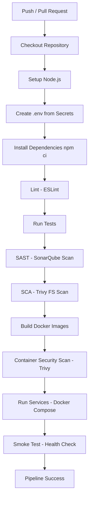
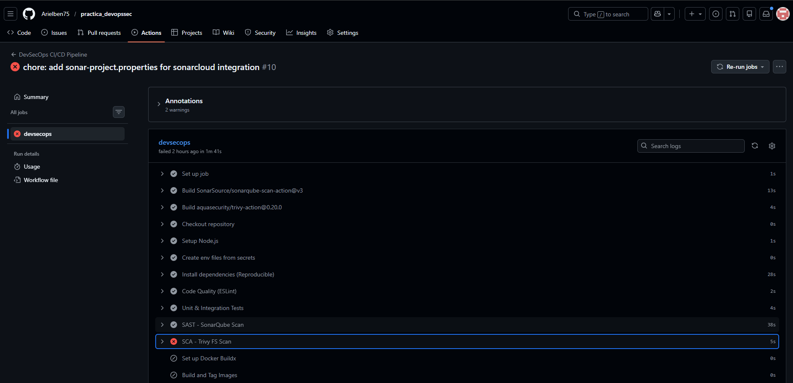
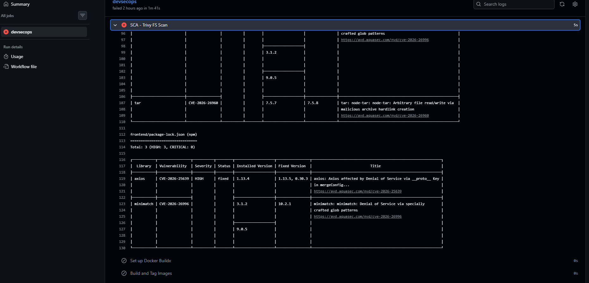
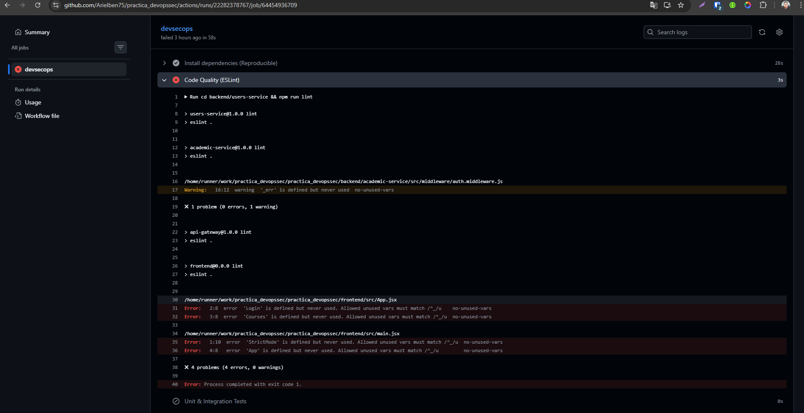
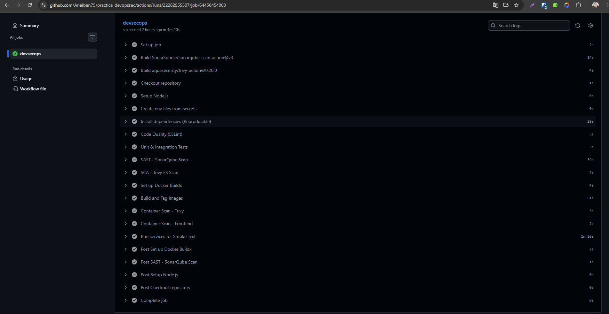
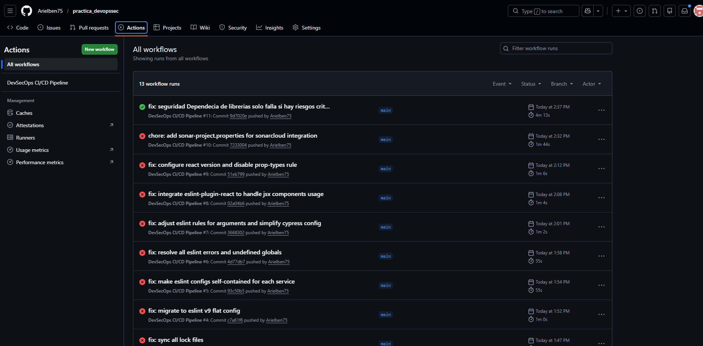

# Documentación DevSecOps CI/CD

Este documento explica las herramientas y fases integradas en el pipeline de CI/CD del proyecto, siguiendo un enfoque de **DevSecOps** explícito.
Este pipeline integra seguridad en cada etapa del desarrollo, no al final. El objetivo es detectar y mitigar vulnerabilidades lo antes posible en el ciclo de vida, reduciendo costos y riesgos en producción.

## REPOSITORIO DE GITHUB

El repositorio del proyecto se encuentra en el siguiente enlace: https://github.com/Arielben75/practica_devopssec.git

## Principios Clave

1. **Shift Left**: La seguridad se valida desde el commit, no después del despliegue
2. **Automatización**: Todos los controles de seguridad se ejecutan sin intervención manual
3. **Observabilidad**:  Cada etapa genera artefactos y reportes para trazabilidad
4. **Reproducibilidad**: El mismo código siempre genera los mismos resultados

## Arquitectura del Pipeline

El pipeline está diseñado para garantizar la calidad, seguridad y reproducibilidad del software en cada etapa del ciclo de vida.

| Fase DevSecOps | Herramienta | Acción | Propósito |
| :--- | :--- | :--- | :--- |
| **Code / Commit** | **ESLint** | Análisis de Estilo (Linting) | Detectar errores comunes, malas prácticas y asegurar consistencia en el código. |
| **Build** | **npm ci** | Instalación Reproducible | Garantiza que las dependencias sean idénticas a las del archivo `package-lock.json`. |
| **Test** | **Jest** | Unit & Integration Testing | Verificar que la lógica de negocio funcione correctamente y evitar regresiones. |
| **Security (SAST)** | **SonarQube** | Análisis Estático de Seguridad | Identificar vulnerabilidades, "code smells" y bugs en el código fuente antes del despliegue. |
| **Security (SCA)** | **Trivy (FS)** | Software Composition Analysis | Escanear las librerías de terceros en busca de vulnerabilidades conocidas (CVEs). |
| **Package** | **Docker** | Build & Versioning | Empaquetar los servicios en contenedores inmutables etiquetados con el hash del commit (`GITHUB_SHA`). |
| **Security (Containers)** | **Trivy (Image)** | Container Image Scan | Escanear la imagen final (sistema operativo base y binarios) antes de ser distribuida. |---

## Configuración Requerida
Para que el pipeline funcione al 100%, se deben configurar los siguientes **GitHub Secrets**:
- `SONAR_TOKEN`: Token generado desde SonarQube.
- `SONAR_HOST_URL`: URL de tu instancia de SonarQube (ej. SonarCloud o instancia propia).

## Diagrama del Pipeline



### **Etapa 1-2: Preparación (Checkout + Setup)**
#### Herramientas
- **actions/checkout@v4**: Descarga el repositorio con historial completo (`fetch-depth: 0`)
- **actions/setup-node@v4**: Instala Node.js v20

#### Fase DevSecOps
**Preparación / Configuración Inicial**

#### Riesgo Mitigado
- Asegura que el código descargado es auténtico y no fue comprometido
- Node.js v20 (LTS) tiene patches de seguridad activados
- El historial completo permite auditar cambios

#### ¿Por qué es necesario?
Incluso un sistema en producción puede ser comprometido si:
- El código descargado está corrupto o modificado
- La versión de Node.js contiene vulnerabilidades conocidas
- No hay trazabilidad de cambios

**Ejemplo de ataque mitigado**: Un atacante modifica el código en el repositorio → el checkout valida la integridad antes de proceder.

---

### **Etapa 3: Configuración de Entorno (.env)**

#### Herramientas
- **Secrets de GitHub**: Almacenamiento cifrado de credenciales
- **Inyección de variables**: Crea archivos `.env` solo en tiempo de ejecución

#### Fase DevSecOps
**Configuración Segura / Hardening**

#### Riesgo Mitigado
- Las credenciales no se almacenan en el repositorio
- Los secretos se inyectan solo en memoria durante ejecución
- Cada servicio obtiene credenciales diferentes
- Los `.env` nunca se commitean

#### ¿Por qué es necesario?
Incluso con un sistema funcional, las credenciales son el activo más valioso:
- Un developer que clona el repo no obtiene acceso a producción
- Si el repositorio se hace público, las credenciales siguen siendo seguras
- Diferentes entornos (dev, staging, prod) usan credenciales distintas

**Ejemplo de ataque mitigado**: Un atacante clona el repositorio → obtiene código pero NO credenciales → no puede acceder a bases de datos.

---

### **Etapa 4: Calidad de Código (ESLint)**

#### Herramientas
- **ESLint**: Analizador estático de JavaScript/TypeScript
- **Configuración**: npm run lint (definida en cada package.json)

#### Fase DevSecOps
**SAST (Static Application Security Testing) / Análisis de Código**

#### Riesgo Mitigado
- **Inyección SQL**: Detecta patrones de concatenación insegura
- **XSS (Cross-Site Scripting)**: Identifica uso de `innerHTML` sin sanitizar
- **Promesas no resueltas**: Evita memory leaks
- **Variables sin usar**: Reduce superficie de ataque
- **Código muerto**: Elimina puntos potenciales de vulnerabilidades
- **Anti-patrones de seguridad**: Reglas como `no-eval`, `no-with`, etc.

#### ¿Por qué es necesario?
- **Detección temprana**: Un lint error se detecta en segundos, no después de desplegar
- **Costo de remediación**: Arreglar en commit es 10x más barato que en producción
- **Cumplimiento**: Muchos estándares (OWASP, PCI-DSS) requieren análisis estático
- **Deuda técnica**: El lint actúa como guardián de calidad permanente

**Ejemplo de ataque mitigado**: 
```javascript
// ESLint detecta esto ANTES de commitear
const query = "SELECT * FROM users WHERE id = " + userId;  // ❌ SQL Injection
```

---

### **Etapa 5: Testing Automático (Unit & Integration Tests)**

#### Herramientas
- **Jest / Mocha / Testing Framework**: Ejecuta suite de pruebas
- **Cobertura de código**: Valida que % de líneas se prueban

#### Fase DevSecOps
**Validación Funcional / Comportamiento Esperado**

#### Riesgo Mitigado
- **Cambios no intencionados**: Las pruebas previenen regresiones
- **Lógica quebrada en autenticación**: Tests unitarios validan JWT, tokens, sesiones
- **Fallos en autorización**: Tests de integración verifican que solo usuarios autorizados acceden a recursos
- **Race conditions**: Tests pueden simular concurrencia
- **Input validation incorrecto**: Tests comprueban que validaciones funcionan

#### ¿Por qué es necesario?
- **Seguridad basada en comportamiento**: Una vulnerabilidad es un comportamiento inesperado
- **Regresiones de seguridad**: Sin tests, un refactor puede eliminar validaciones
- **Documentación viva**: Los tests demuestran cómo "debería" comportarse el sistema

**Ejemplo de ataque mitigado**:
```javascript
test('debe rechazar usuarios sin tokens', () => {
  const response = request(app).get('/api/protected');
  expect(response.status).toBe(401);  // ❌ Si esto falla, hay una brecha
});
```

---

### **Etapa 6: SAST - SonarQube**

#### Herramientas
- **SonarQube**: Plataforma de análisis de código estático
- **Sonarqube-scan-action@v3**: Integración oficial en GitHub Actions
- **SONAR_TOKEN + SONAR_HOST_URL**: Credenciales para enviar resultados

#### Fase DevSecOps
**SAST Avanzado / Análisis Profundo de Seguridad**

#### Riesgo Mitigado
- **Vulnerabilidades OWASP Top 10**: Detecta CWE-89 (SQL Injection), CWE-79 (XSS), etc.
- **Code Smells**: Identifica patrones que podrían llevar a vulnerabilidades
- **Duplicación de código**: Reduce la superficie vulnerable (duplicado = múltiples puntos de ataque)
- **Complejidad ciclomática**: Código complejo es difícil de auditar y más propenso a errores
- **Cobertura de tests**: Áreas sin tests son puntos ciegos de seguridad
- **Deuda técnica**: Rastreo continuo de deuda acumulada

#### ¿Por qué es necesario?
- **ESLint es superficial**: Valida sintaxis y patrones simples
- **SonarQube es profundo**: Analiza flujo de datos, taint analysis, símbolos
- **Visibilidad del proyecto**: Dashboard histórico muestra evolución de calidad
- **Control de puerta**: Puede bloquear merges si vulnerabilidades > umbral

**Diferencia clave**:
```javascript
// ESLint detecta esto (sintaxis):
eval(userInput);  // ❌ ESLint lo marca

// SonarQube detecta ESTO (semántica):
let query = "SELECT * FROM users WHERE id = ";
query += userInput;  // ❌ SonarQube ve el taint flow
```

---

### **Etapa 7: SCA - Trivy FS Scan (Dependencias)**

#### Herramientas
- **Trivy**: Scanner de vulnerabilidades de seguridad
- **Modo FS (Filesystem)**: Escanea `package.json`, `npm-shrinkwrap.json`, `yarn.lock`
- **Severidad CRITICAL**: Solo detiene si hay vulnerabilidades críticas
- **Aquasecurity/trivy-action@0.20.0**: Integración oficial

#### Fase DevSecOps
**SCA (Software Composition Analysis) / Análisis de Dependencias**

#### Riesgo Mitigado
- **Librerías vulnerables conocidas (Known CVEs)**: Log4j, express-js bugs, etc.
- **Dependencias transitorias comprometidas**: Una librería que usas depende de otra vulnerable
- **Versiones desactualizadas**: Versiones viejas no reciben patches
- **Licencias problemáticas**: GPL en código propietario (riego legal, no de seguridad)
- **Supply chain attacks**: Un paquete npm malicioso en la cadena de dependencias

#### ¿Por qué es necesario?
- **No puedes revisar 1,000+ paquetes a mano**: Trivy hace automático lo imposible manual
- **Las vulnerabilidades cambian diariamente**: 10,000+ CVEs nuevas por año
- **npm es un objetivo**: Paquetes populares son atacados regularmente

**Ejemplo real**: Evento de `node-uuid` donde un paquete fue comprometido con minero de criptomonedas. Trivy hubiera detectado el comportamiento sospechoso.

---

### **Etapa 8: Build de Contenedores y Versionado**

#### Herramientas
- **Docker**: Build de imágenes reproducibles
- **docker/setup-buildx-action@v3**: Buildx para builds optimizados y multiplataforma
- **Versionado por SHA**: Cada imagen se etiqueta con `git.sha` para trazabilidad

#### Fase DevSecOps
**Construcción / Artefactos Auditables**

#### Riesgo Mitigado
- **Inmutabilidad de artefactos**: Un SHA es único para ese código exacto
- **Builds no reproducibles**: Mismo código = misma imagen = confianza
- **Cambios no registrados**: Docker layers pueden auditarse
- **Contaminación de ambiente**: Docker aísla dependencias del sistema host

#### ¿Por qué es necesario?
- **Imágenes son el "ejecutable" final**: Si no confías en la imagen, no confías en nada después
- **Auditoría**: `docker history` muestra cada paso
- **Reversión rápida**: Etiqueta por SHA permite rollback exacto

---

### **Etapa 9: Container Scan - Trivy (Imágenes)**

#### Herramientas
- **Trivy image-ref mode**: Escanea capas de imágenes Docker
- **Severidad CRITICAL**: exit-code 1 (detiene pipeline si hay críticos)
- **Escaneo de librerías en la imagen**: Detecta vulnerabilidades en sistema operativo + dependencias

#### Fase DevSecOps
**Container Security / Análisis de Imágenes**

#### Riesgo Mitigado
- **Vulnerabilidades en capas base**: Ubuntu 20.04 con libc viejo
- **Binarios vulnerables en la imagen**: `curl`, `wget`, `openssl` desactualizados
- **Dependencias añadidas en Docker**: npm instala versiones vulnerables
- **Imágenes con usuarios root**: Escalación de privilegios
- **Archivos sensibles no eliminados**: Claves privadas en imágenes
- **Malware en capas base**: Imágenes públicas pueden estar comprometidas

#### ¿Por qué es necesario?
- **Las dependencias son solo código Node**: La imagen también incluye SO
- **Una vulnerabilidad en libc afecta a TODO**: Trivy valida que libc, openssl, etc. sean seguros
- **Las imágenes base no siempre se actualizan**: Un alpine:latest de hace un año tiene CVEs

**Ejemplo**: 
```dockerfile
FROM ubuntu:20.04  # ← openssl 1.1.1 (vulnerable)
RUN npm install    # ← npm packages (también pueden ser vulnerables)
```
Trivy detecta ambas capas.

---

### **Etapa 10: Smoke Test (Opcional - Pre-Deploy)**

#### Herramientas
- **docker-compose**: Levanta servicios completos
- **curl**: Valida endpoints funcionales
- **Health checks**: `/health` endpoint debe responder 200

#### Fase DevSecOps
**Validación Operacional / Integración Completa**

#### Riesgo Mitigado
- **Fallos en despliegue**: Descubre problemas antes de ir a producción
- **Misconfiguraciones de red**: Puertos, variables de entorno
- **Dependencias no disponibles**: Bases de datos, servicios externos
- **Cambios que rompen funcionalidad**: Integración cross-service

#### ¿Por qué es necesario?
- **Todas las validaciones anteriores son técnicas**: Smoke test es comportamental
- **Edge case de integración**: Dos servicios pueden pasar tests unitarios pero fallar juntos
- **Confianza pre-deploy**: Último checkpoint antes de producción

---

## 📸 Capturas de Pantalla

### Configuración error en escaneo de trivy



### Configuración error no deja pasar si hay escanesos de seguridad de tipo HIGH



### Error no deja pasar si la calidad del codigo no es la configurada



### CI/CD completado para la configuracion de DevOpsSEc



### Workflos del proyecto

